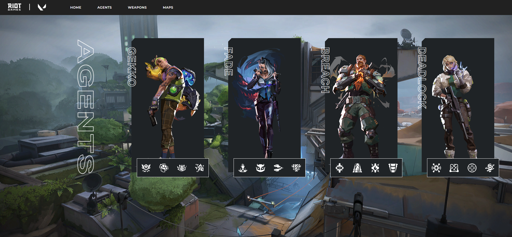

# VALORANT

Este proyecto fue generado con Angular CLI versión 17.3.6.

## Servidor de desarrollo

Ejecuta `ng serve` para iniciar un servidor de desarrollo. Navega a `http://localhost:4200/`. La aplicación se recargará automáticamente si cambias alguno de los archivos fuente.

## Generación de código

Ejecuta `ng generate component nombre-componente` para generar un nuevo componente. También puedes usar `ng generate directive|pipe|service|class|guard|interface|enum|module`.

## Construcción
Ejecuta `ng build` para compilar el proyecto. Los artefactos de compilación se almacenarán en el directorio `dist/`.

## Vista de agents
En el componente agents.component, creamos una carpeta de servicios para consumir la API de Valorant. Luego, en el HTML, accedemos al objeto y recorremos los datos. 

     

## Recursos y Herramientas

